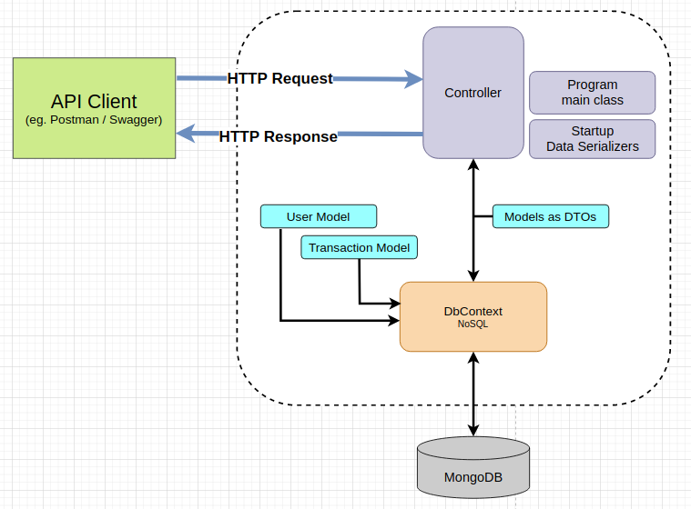

# bank-dotnet-webapi

This is a project made for a test related to WebAPIs.

## Main Architecture (ASP.NET MVC WebAPI)



# Docker Instructions
- install [docker](https://www.docker.com/)
- run the following command line (**use PowerShell** if using Windows):
```console
docker network create bankapi-fobenga ; docker run -d --rm --name mongo -p 27017:27017 -v mongodbdata:/data/db -e MONGO_INITDB_ROOT_USERNAME=mongoadmin -e MONGO_INITDB_ROOT_PASSWORD=fobenga123 --network=bankapi-fobenga mongo ; docker run -it --rm -p 8080:80 -e MongoDbSettings:Host=mongo -e MongoDbSettings:Password=fobenga123 --network=bankapi-fobenga fobenga/bank:v1
```
- do HTTP requests at: ```http://localhost:8080/{endpoint}```
- when finished, you can remove the docker network by running the following command line (**use PowerShell** if using Windows):
```console
docker stop mongo ; docker network rm bankapi-fobenga
```
- Link to the [Public repository of the container](https://hub.docker.com/r/fobenga/bank)


# Local Build Instructions
 - install [.NET Core 5 Runtime and SDK](https://dotnet.microsoft.com/download).
 - run [mongodb](https://www.mongodb.com/) in Docker, using the command line below:
 ```console
docker network create bankapi-fobenga ; docker run -d --rm --name mongo -p 27017:27017 -v mongodbdata:/data/db -e MONGO_INITDB_ROOT_USERNAME=mongoadmin -e MONGO_INITDB_ROOT_PASSWORD=fobenga123 --network=bankapi-fobenga mongo
```
 - install [Visual Studio Code](https://code.visualstudio.com/) (.vscode file already configured to build from TEST and DEV envs).
 - install the [MongoDB VS Code Extension](https://marketplace.visualstudio.com/items?itemName=mongodb.mongodb-vscode).
 - **Ctrl+Shift+B** in VS Code to build the project and install Nuget packages.
 - if something else is needed, run ```dotnet restore``` via command line in the root directory.
 - **F5** to run in Debug mode.
# Healthcheck Endpoints:
- Database Integrity (check if the HTTP requests are available): ```http://localhost:8080/status/ready```
- Server Integrity (check if the server is online): ```http://localhost:8080/status/live```

# HTTP Endpoints:

## [GET] Get all users

    [GET] endpoint: users/

Example response:

```json
    [
        {
            "id": "3fa85f64-5717-4562-b3fc-2c963f66afa6",
            "staff": false,
            "name": "string",
            "balance": 0.0
        },
    ]
```
```md
"staff" = true: staff user / false: common user
```
## [GET] Get user by Id

    [GET] endpoint: users/{id}

Example response:
```json
    {
      "id": "3fa85f64-5717-4562-b3fc-2c963f66afa6",
      "staff": false,
      "name": "string",
      "balance": 0.0
    }
```
```md
"staff" = true: staff user / false: common user
```
## [POST] Create User

     [POST] endpoint: users/

Post model:
```json
    {
      "staff": false,
      "name": "string",
      "cpf": "string",
      "email": "string",
      "password": "string"
    }
```
```md
"staff" = true: staff user / false: common user
"cpf" = string pattern: 999.999.999-99 OR 99999999999
"email" = string pattern: aaa@aaa.aaa
```

## [GET] See All Transactions

      [GET] endpoint: transactions/

Example response:
```json
      [
        {
          "id": "3fa85f64-5717-4562-b3fc-2c963f66afa6",
          "sender": "3fa85f64-5717-4562-b3fc-2c963f66afa6",
          "receiver": "3fa85f64-5717-4562-b3fc-2c963f66afa6",
          "createdAt": "2021-10-23T01:54:07.493Z",
          "amount": 0.0
        },
      ]
```

## [GET] Get Transaction By Id

      [GET] endpoint: transactions/{id}


Example response:
```json
[
   {
      "id": "3fa85f64-5717-4562-b3fc-2c963f66afa6",
      "sender": "3fa85f64-5717-4562-b3fc-2c963f66afa6",
      "receiver": "3fa85f64-5717-4562-b3fc-2c963f66afa6",
      "createdAt": "2021-10-23T01:54:07.493Z",
      "amount": 0.0
   }
]
```
## [POST] Create Transaction

     [POST] endpoint: transactions/create

Post model:
```json
    {
      "sender": "3fa85f64-5717-4562-b3fc-2c963f66afa6",
      "receiver": "3fa85f64-5717-4562-b3fc-2c963f66afa6",
      "amount": 0.0
    }
```
```md
"sender" = Guid of the sender
"receiver" = Guid of the receiver
"amount" = amount of money (in double)
```

## [POST] Undo Transaction

    [POST] endpoint: transactions/undotransaction/{id}

No response.
